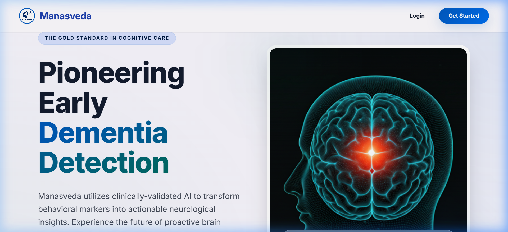
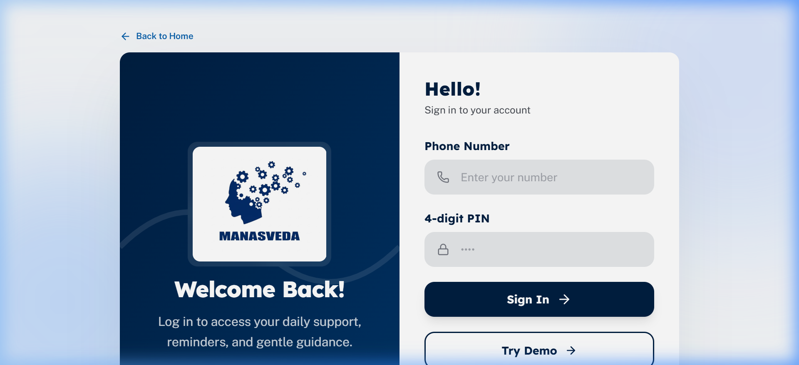
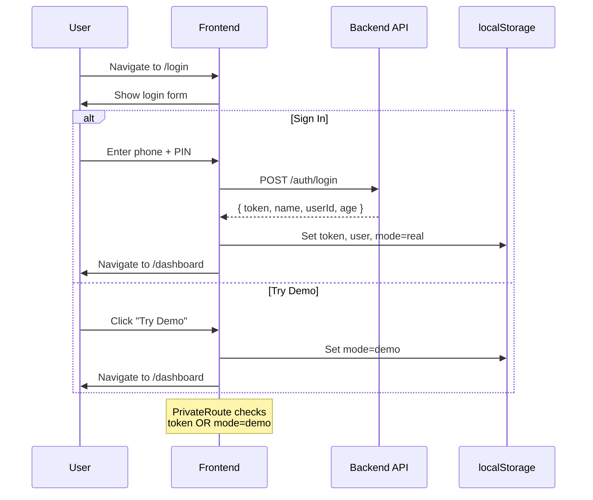

<p align="center">
  
</p>

<h1 align="center">Manasveda — Frontend</h1>

<p align="center">
  <b>Advanced Cognitive Health Platform · Early Dementia Detection with AI</b><br/>
  <sub>Built with React 19 · Vite 8 · Tailwind CSS 4 · Recharts · Lucide Icons</sub>
</p>

<p align="center">
  
  
  
  
</p>

---

## 📑 Table of Contents

- [Product Overview (PRD)](#-product-overview-prd)
- [Screenshots](#-screenshots)
- [Tech Stack](#-tech-stack)
- [Project Architecture](#-project-architecture)
- [Directory Structure](#-directory-structure)
- [Routing & Navigation](#-routing--navigation)
- [Page-by-Page Breakdown](#-page-by-page-breakdown)
- [Component Library](#-component-library)
- [Design System](#-design-system)
- [API Flow & Integration](#-api-flow--integration)
- [State Management](#-state-management)
- [Custom Hooks](#-custom-hooks)
- [Authentication Flow](#-authentication-flow)
- [Demo Mode](#-demo-mode)
- [Cognitive Game Suite](#-cognitive-game-suite)
- [Chat System & NLP Pipeline](#-chat-system--nlp-pipeline)
- [Reporting Engine](#-reporting-engine)
- [Environment Configuration](#-environment-configuration)
- [Getting Started](#-getting-started)
- [Deployment](#-deployment)
- [Key Design Decisions](#-key-design-decisions)

---

## 📋 Product Overview (PRD)

### Vision

**Manasveda** (Sanskrit: "Knowledge of the Mind") is a clinically-inspired cognitive health platform that uses AI-driven behavioral analysis to detect early signs of dementia and cognitive decline. The platform transforms everyday digital interactions — chat conversations, cognitive games, and daily task completion — into actionable neurological insights.

### Target Users

| Persona | Description |
|---------|-------------|
| **Primary User (65+)** | Elderly individuals who want to monitor their cognitive health proactively |
| **Caregiver** | Family members or healthcare workers who receive alerts and monitor progress |
| **Demo Explorer** | Visitors who want to try the platform without signing up |

### Core Value Proposition

```
Behavioral Markers → AI Analysis → Cognitive Risk Score → Actionable Insights
```

1. **Non-intrusive assessment** — No clinical tests required; cognitive signals are extracted from natural interactions
2. **Multi-signal fusion** — Combines game performance, chat linguistics, and daily activity adherence
3. **Longitudinal tracking** — Monitors trends over days/weeks to detect subtle cognitive shifts
4. **Dual-mode access** — Real user mode with full persistence + Demo mode for instant exploration

### Key Features

| Feature | Description | Page |
|---------|-------------|------|
| 🧠 **Cognitive Dashboard** | Real-time scores, weekly trends, AI summary, risk gauge | `/dashboard` |
| 🎮 **Game Suite** | 5 clinically-inspired cognitive games with score tracking | `/games` |
| 💬 **AI Chat Assessment** | Conversational AI that extracts linguistic biomarkers | `/chat` |
| 📊 **Cognitive Reports** | Historical trends, domain analysis, chat insights | `/reports` |
| ✅ **Daily Checklist** | Task adherence tracking across cognitive/social/physical domains | `/tasks` |
| 🏠 **Landing Page** | Public marketing page with ecosystem overview and user flow | `/` |

---

## 📸 Screenshots

### Landing Page


### Login Screen


---

## 🛠 Tech Stack

| Layer | Technology | Version | Purpose |
|-------|-----------|---------|---------|
| **Framework** | React | 19.2.4 | UI component library |
| **Build Tool** | Vite | 8.0.1 | Development server & bundler |
| **Styling** | Tailwind CSS | 4.2.2 | Utility-first CSS framework |
| **Routing** | React Router DOM | 7.13.2 | Client-side SPA routing |
| **HTTP Client** | Axios | 1.14.0 | API communication with interceptors |
| **Charts** | Recharts | 3.8.1 | Data visualization (line, bar, pie) |
| **Icons** | Lucide React | 1.7.0 | Consistent icon system |
| **Icons (Material)** | Material Symbols | CDN | Google Material Design icons |
| **Utility** | clsx + tailwind-merge | - | Conditional className composition |
| **Fonts** | Inter, Lexend, Public Sans | Google Fonts | Typography system |
| **Deployment** | Vercel | - | Static hosting with SPA rewrites |

---

## 🏗 Project Architecture

```
┌─────────────────────────────────────────────────────────────────┐
│                        BROWSER (SPA)                            │
│                                                                 │
│  ┌──────────────┐   ┌──────────────┐   ┌──────────────────────┐ │
│  │  Landing Page │   │  Auth Pages  │   │  Protected App Shell │ │
│  │  (Public)     │   │  Login/Signup│   │  ┌────────────────┐  │ │
│  │              │   │              │   │  │    Sidebar      │  │ │
│  │  - Navbar    │   │  - Phone/PIN │   │  │    Topbar       │  │ │
│  │  - Hero      │   │  - Signup    │   │  │    ┌──────────┐ │  │ │
│  │  - UserFlow  │   │    form      │   │  │    │  Outlet  │ │  │ │
│  │  - Ecosystem │   │  - Demo mode │   │  │    │ (Pages)  │ │  │ │
│  │  - Journey   │   │    button    │   │  │    └──────────┘ │  │ │
│  │  - CTA       │   │              │   │  └────────────────┘  │ │
│  │  - Footer    │   │              │   │                      │ │
│  └──────────────┘   └──────────────┘   └──────────────────────┘ │
│                                                                 │
│  ┌────────────────────────────────────────────────────────────┐  │
│  │              Axios Instance (API Layer)                    │  │
│  │   • Base URL from VITE_API_URL env var                    │  │
│  │   • Auto-attach Bearer token from localStorage            │  │
│  │   • 401 interceptor → auto-logout → redirect to /login   │  │
│  └────────────────────┬───────────────────────────────────────┘  │
│                       │                                         │
└───────────────────────┼─────────────────────────────────────────┘
                        │ HTTPS REST
                        ▼
              ┌──────────────────────┐
              │   Backend API Server │
              │   (Node.js/Express)  │
              │   Render Hosted      │
              └──────────────────────┘
```

---

## 📂 Directory Structure

```
frontend/
├── public/                          # Static assets served at root
│   ├── favicon.svg                  # App favicon
│   ├── icons.svg                    # SVG sprite
│   ├── image.png                    # Favicon source (PNG)
│   └── logo.jpeg                    # Manasveda brand logo
│
├── src/
│   ├── api/
│   │   └── axiosInstance.js         # Configured Axios: baseURL, auth interceptor, 401 handler
│   │
│   ├── assets/
│   │   ├── hero.png                 # Hero section image
│   │   ├── react.svg                # React logo
│   │   └── vite.svg                 # Vite logo
│   │
│   ├── components/
│   │   ├── PrivateRoute.jsx         # Auth guard: checks token or demo mode
│   │   │
│   │   ├── charts/
│   │   │   └── ProgressChart.jsx    # Reusable progress chart component
│   │   │
│   │   ├── games/
│   │   │   ├── SequenceMemoryGame.jsx  # Sequence memory game (standalone)
│   │   │   └── TargetPracticeGame.jsx  # Target practice game (standalone)
│   │   │
│   │   ├── landing/                 # Public landing page components
│   │   │   ├── index.js             # Barrel exports
│   │   │   ├── CTASection.jsx       # Bottom call-to-action
│   │   │   ├── EcosystemSection.jsx # Platform ecosystem overview
│   │   │   ├── FeatureCard.jsx      # Reusable feature card
│   │   │   ├── HeroSection.jsx      # Hero banner with CTAs
│   │   │   ├── JourneySection.jsx   # 3-step journey visualization
│   │   │   ├── LandingFooter.jsx    # Footer with links and social
│   │   │   ├── LandingNavbar.jsx    # Transparent floating navbar
│   │   │   └── UserFlowSection.jsx  # New user flow visualization
│   │   │
│   │   ├── layout/                  # App shell components
│   │   │   ├── Layout.jsx           # Main layout: Sidebar + Topbar + Outlet
│   │   │   ├── Navbar.jsx           # Alternative navbar (unused)
│   │   │   ├── Sidebar.jsx          # Fixed left sidebar with nav icons
│   │   │   └── Topbar.jsx           # Top header with user info and demo badge
│   │   │
│   │   ├── ui/                      # Primitive UI components
│   │   │   ├── Badge.jsx            # Status badge (low/med/hi/info variants)
│   │   │   ├── Card.jsx             # Card, CardLabel, SectionTitle, MiniLabel
│   │   │   └── TaskItem.jsx         # Single task row with checkbox
│   │   │
│   │   └── widgets/                 # Dashboard widget components
│   │       ├── DailyProgressCalendar.jsx  # Monthly activity calendar
│   │       ├── ScoreCard.jsx              # KPI stat card
│   │       └── TasksListWidget.jsx        # Task list widget
│   │
│   ├── data/
│   │   └── demoData.js              # Static demo data for dashboard & reports
│   │
│   ├── hooks/
│   │   ├── useAppMode.js            # real/demo mode management + localStorage persistence
│   │   └── useChatTracker.js        # Chat biometric extraction (WPM, pauses, repetitions)
│   │
│   ├── layouts/
│   │   ├── DashboardLayout.jsx      # Alternative dashboard layout wrapper
│   │   └── Navbar.jsx               # Layout-level navbar
│   │
│   ├── lib/
│   │   └── utils.js                 # cn() utility — clsx + tailwind-merge
│   │
│   ├── pages/                       # Route-level page components
│   │   ├── LandingPage.jsx          # Public landing (/) — assembles landing sections
│   │   ├── Login.jsx                # Phone + PIN login (/login)
│   │   ├── Signup.jsx               # Registration form (/signup)
│   │   ├── Dashboard.jsx            # Main dashboard (/dashboard)
│   │   ├── Games.jsx                # Cognitive game suite (/games)
│   │   ├── Chat.jsx                 # AI chat assessment (/chat)
│   │   ├── Reports.jsx              # Cognitive health reports (/reports)
│   │   └── Tasks.jsx                # Daily checklist (/tasks)
│   │
│   ├── styles/
│   │   └── landing.css              # Landing page design system (CSS variables, animations)
│   │
│   ├── utils/
│   │   └── index.js                 # Constants (API_BASE_URL), helpers (formatScore, getUserId)
│   │
│   ├── App.jsx                      # Root component: BrowserRouter + Routes
│   ├── App.css                      # Legacy app styles
│   ├── index.css                    # Global Tailwind v4 theme: color tokens, Material Design 3
│   └── main.jsx                     # Entry point: ReactDOM.createRoot()
│
├── .env                             # Environment variables (VITE_API_URL)
├── .env.example                     # Env template for developers
├── index.html                       # HTML shell: meta tags, fonts, root div
├── package.json                     # Dependencies & scripts
├── vite.config.js                   # Vite plugins: Tailwind CSS + React
├── vercel.json                      # SPA rewrite rules for Vercel
└── eslint.config.js                 # ESLint configuration
```

---

## 🔀 Routing & Navigation

### Route Map

```
/                   → LandingPage         (Public)
/login              → Login               (Public)
/signup             → Signup              (Public)
│
├── PrivateRoute (auth guard)
│   ├── Layout (Sidebar + Topbar shell)
│   │   ├── /dashboard  → Dashboard
│   │   ├── /games      → Games
│   │   ├── /chat       → Chat
│   │   ├── /reports    → Reports
│   │   └── /tasks      → Tasks
│
/*                  → Navigate to "/"     (Catch-all redirect)
```

### Navigation Guard

`PrivateRoute.jsx` checks for:
- `localStorage.token` — real JWT from backend
- `localStorage.mode === 'demo'` — demo access bypass

If neither exists, redirects to `/login`.

### Sidebar Navigation Items

| Icon | Label | Route |
|------|-------|-------|
| `dashboard` | Dashboard | `/dashboard` |
| `extension` | Games | `/games` |
| `forum` | Chat | `/chat` |
| `assessment` | Reports | `/reports` |

---

## 📄 Page-by-Page Breakdown

### 1. Landing Page (`/`)

**File:** `src/pages/LandingPage.jsx`

The public-facing marketing page that introduces Manasveda to visitors.

**Sections (in order):**

| Section | Component | Description |
|---------|-----------|-------------|
| 1 | `LandingNavbar` | Fixed transparent navbar with logo, Login button, and Get Started CTA |
| 2 | `HeroSection` | Full-width hero with headline "Pioneering Early Dementia Detection", brain visualization image, glass card overlay |
| 3 | `UserFlowSection` | Visual diagram showing the 3-step new user onboarding flow |
| 4 | `EcosystemSection` | 3-card grid showcasing the product pillars (Games, Chat, Reports) |
| 5 | `JourneySection` | Numbered journey steps with icon circles |
| 6 | `CTASection` | Bottom call-to-action with "Start Cognitive Test" button |
| 7 | `LandingFooter` | Footer with social links, contact info, legal links |

**Navigation rules:**
- All CTAs route to `/login` (users must authenticate first)
- "Clinical Research" smooth-scrolls to `#science` anchor

---

### 2. Login Page (`/login`)

**File:** `src/pages/Login.jsx`

Split-screen layout:
- **Left panel:** Dark gradient with logo and welcome message
- **Right panel:** Login form

**Form fields:**
- Phone number (`tel` input)
- 4-digit PIN (`password` input, numeric, maxLength=4)

**Actions:**
- **Sign In** → `POST /api/auth/login` → stores `token`, `user`, `mode=real` → navigates to `/dashboard`
- **Try Demo** → sets `mode=demo` in localStorage → navigates to `/dashboard`
- **Sign up** → Link to `/signup`
- **Back to Home** → navigates to `/`

---

### 3. Signup Page (`/signup`)

**File:** `src/pages/Signup.jsx`

5-column grid layout (2 left visual + 3 right form).

**Form fields:**

| Field | Type | Required |
|-------|------|----------|
| Full Name | text | ✅ |
| Phone Number | tel | ✅ |
| 4-digit PIN | password | ✅ |
| Age | number | ✅ |
| Education Level | select (none/primary/secondary/graduate) | ✅ |
| Lives Alone | checkbox | ❌ |
| Caregiver Phone | tel | ❌ |
| Caregiver Email | email | ❌ |

**API:** `POST /api/auth/register` → stores token + user → navigates to `/dashboard`

---

### 4. Dashboard (`/dashboard`)

**File:** `src/pages/Dashboard.jsx`

The cognitive health command center. Features a two-column layout:

**Main content area:**
- **Greeting section** — Time-based greeting with user's first name
- **Hero CTA card** — Gradient card prompting daily cognitive test
- **4 KPI cards** — Today's Score, Overall Score, Progress %, Risk Level
- **Weekly performance chart** — SVG line chart with gradient fill
- **Cognitive distribution** — SVG donut chart (Focus/Memory/Logic)

**Right sidebar (xl+ screens):**
- **Daily Presence calendar** — 30-day grid with active day highlights
- **AI Summary** — AI-generated insight text
- **Cognitive Risk Status** — Semi-circle gauge with risk level

**Data flow:**
- Demo mode → static `demoData` object
- Real mode → `GET /api/dashboard` → maps response to display model

---

### 5. Games Page (`/games`)

**File:** `src/pages/Games.jsx` (1266 lines)

The largest page — a complete cognitive game suite with 5 games.

**State machine:** `home → start → playing → result → home`

**Games:**

| # | Game | ID | Cognitive Domain | Mechanic |
|---|------|----|-----------------|----------|
| 1 | Reaction Time | `reaction` | Processing Speed | Red→Green click test, 5 rounds |
| 2 | Number Memory | `number` | Executive Function | Memorize increasing digit sequences |
| 3 | Verbal Memory | `verbal` | Linguistic Center | NEW/SEEN word classification, 5 lives |
| 4 | Chimp Test | `chimp` | Visual-Spatial | Click numbered squares in ascending order |
| 5 | Target Practice | `target` | Visual-Motor Speed | Click appearing targets, 15 rounds |

**Sub-components:**
- `GameStartScreen` — Instruction card with 2-second countdown
- `ResultScreen` — Score display, rating, performance breakdown, auto-advances to next game
- `HomeGrid` — Card grid displaying all available games
- `ReportDashboard` — Performance stats and 7-day score trend chart
- `GameActivityDialog` — Modal showing today/lifetime stats per game
- `LivesBar` — Heart-based lives display

**Score persistence:**
- **Local:** `localStorage` keyed by `cg_scores_{gameId}` → per-day best scores
- **API:** `POST /api/sessions/game` + `POST /api/game-scores` on game completion

---

### 6. Chat Page (`/chat`)

**File:** `src/pages/Chat.jsx`

AI-powered conversational assessment that extracts cognitive biomarkers from natural language.

**Features:**
- Real-time chat with Lucid AI (Gemini-powered backend)
- Multi-language support (English, Hindi, Hinglish)
- Session timer with 10-minute auto-end
- Live typing metrics panel (slide-out drawer)
- WPM sparkline chart (SVG bar chart)
- Session end → AI analysis → Risk badge + Language score

**Behavioral signals tracked:**
- Average words per minute (WPM)
- WPM variance (first half vs second half)
- Backspace rate (hesitation indicator)
- Average pause between messages
- Phrase repetition count (3-gram overlap)
- Average sentence length

**Session lifecycle:**
1. Page load → `POST /api/chat/message` with greeting
2. User sends messages → real-time metric tracking via `useChatTracker`
3. After 3+ messages → "End Session" button appears
4. End session → `POST /api/sessions/chat` with behavioral payload
5. Poll `GET /api/sessions/chat/{id}` every 2s until analysis complete
6. Display risk level, language score, and explanation
7. "View full report" → navigates to `/reports`

---

### 7. Reports Page (`/reports`)

**File:** `src/pages/Reports.jsx`

Comprehensive cognitive health reporting dashboard.

**Sections:**

| Section | Description | Data Source |
|---------|-------------|-------------|
| **Overall Cognitive Profile** | Composite risk score/100, risk badge, stage, source breakdown (Game 40%, Chat 30%, Webcam 20%, Tasks 10%) | `GET /api/dashboard/reports/summary` |
| **30-Day Risk Score Trend** | Line chart with improvement/decline insights | `GET /api/dashboard/reports/history` |
| **Peak Cognitive Performance** | Bar chart of game domain scores | Same as above |
| **Today's Metrics** | Stage progression, avg WPM, engagement rate | `GET /api/dashboard/reports/today` |
| **7-Day History** | Table with daily risk score, stage, status badge | Summary API |
| **Recent Chat Insights** | Card list of past chat sessions with risk level, language score, explanation | History API |
| **Streak & Tips** | Current streak count + personalized tip | Summary API |

**Smart insights:** Auto-generated trend analysis and domain analysis based on data patterns.

---

### 8. Tasks Page (`/tasks`)

**File:** `src/pages/Tasks.jsx`

Daily checklist for holistic cognitive health maintenance.

**Categories:**

| Category | Color | Example Tasks |
|----------|-------|---------------|
| 🧠 Cognitive | `#6d5cf7` | Complete brain activity |
| 🤝 Social | `#1D9E75` | Check in with companion, call family |
| 💪 Physical | `#3B8BD4` | Gentle stretching, hydration |
| 🧘 Mental | `#EF9F27` | Grounding exercise (name 5 things) |

**Features:**
- Completion percentage bar
- Optimistic UI updates on toggle
- `PATCH /api/tasks/{id}` for persistence
- Fallback to default tasks if API fails
- Motivational streak counter

---

## 🧩 Component Library

### UI Primitives (`src/components/ui/`)

| Component | Props | Description |
|-----------|-------|-------------|
| `Card` | `className`, `children` | Bordered container with background and rounded corners |
| `CardLabel` | `className`, `children` | Small uppercase label text |
| `CardBigValue` | `className`, `children` | Large value display (26px) |
| `SectionTitle` | `className`, `children` | Section heading (13px, medium weight) |
| `MiniLabel` | `className`, `children` | Tiny label (11px) |
| `Badge` | `variant`, `className`, `children` | Status badges: `default`, `low`, `med`, `hi`, `info` |
| `TaskItem` | `done`, `dotColor`, `label`, `className` | Task row with circle checkbox + color dot |

### Layout Components (`src/components/layout/`)

| Component | Description |
|-----------|-------------|
| `Layout` | App shell: renders `Sidebar`, `Topbar`, and `<Outlet />` with `ml-20 pt-20` offsets |
| `Sidebar` | Fixed 80px-wide left sidebar with icon nav buttons + logout |
| `Topbar` | Fixed top header with brand name, demo badge, notifications, user avatar |

### Landing Components (`src/components/landing/`)

| Component | Description |
|-----------|-------------|
| `LandingNavbar` | Transparent sticky navbar with logo + Login/Get Started buttons |
| `HeroSection` | Full-width hero with gradient text, brain image, glass card |
| `UserFlowSection` | Numbered step visualization of the onboarding process |
| `EcosystemSection` | 3-column feature cards with icons |
| `JourneySection` | Step-by-step journey with numbered circles |
| `FeatureCard` | Reusable card with icon, title, description, chips |
| `CTASection` | Bottom call-to-action banner |
| `LandingFooter` | Social links, legal info, contact |

### Game Components (`src/components/games/`)

| Component | Description |
|-----------|-------------|
| `TargetPracticeGame` | Self-contained target clicking game with floating metrics sidebar |
| `SequenceMemoryGame` | Sequence memory tile-flashing game |

---

## 🎨 Design System

### Color Palette (Material Design 3 inspired)

The app uses a comprehensive token system defined in `src/index.css`:

#### Semantic Colors

| Token | Value | Usage |
|-------|-------|-------|
| `--color-primary` | `#0058bf` | Primary actions, active states |
| `--color-secondary` | `#006a61` | Success-like states, secondary actions |
| `--color-tertiary` | `#4b41e1` | AI features, accent highlights |
| `--color-error` | `#ba1a1a` | Error states, danger |

#### Surface Hierarchy

| Token | Value | Usage |
|-------|-------|-------|
| `--color-surface` | `#faf8ff` | Default page background |
| `--color-surface-container-lowest` | `#ffffff` | Card backgrounds |
| `--color-surface-container-low` | `#f2f3ff` | Subtle card backgrounds |
| `--color-surface-container` | `#eaedff` | Elevated cards |
| `--color-surface-container-high` | `#e2e7ff` | Active/hover states |

#### Semantic Feedback

| Category | Background | Text | Border |
|----------|-----------|------|--------|
| Success | `#e1f5ee` | `#0f6e56` | `#5DCAA5` |
| Warning | `#faeeda` | `#854f0b` | `#EF9F27` |
| Danger | `#fcebeb` | `#a32d2d` | — |
| Info | `#e6f1fb` | `#185fa5` | `#85B7EB` |

### Typography

| Font | Usage |
|------|-------|
| **Inter** (300–800) | Body text across the app |
| **Lexend** (400–800) | Auth page headlines |
| **Public Sans** (400–600) | Auth page body text |
| **Material Symbols Outlined** | Icon system throughout app |

### Landing Page Design System (`landing.css`)

Separate design token namespace (`--ls-*`) for the public landing pages:
- Full color palette with primary blues, secondary teals, tertiary purples
- Glass panel effects (backdrop-blur)
- Custom animations (`ls-fade-up`, `ls-fade-in`)
- Responsive spacing tokens
- Button variants (primary gradient, secondary outlined, ghost)
- Card hover effects with shadow escalation

---

## 🔌 API Flow & Integration

### Axios Configuration

**File:** `src/api/axiosInstance.js`

```javascript
const api = axios.create({
  baseURL: import.meta.env.VITE_API_URL || 'http://localhost:5000/api',
});
```

**Request interceptor:** Auto-attaches `Authorization: Bearer {token}` from localStorage
**Response interceptor:** On 401 → clears token → redirects to `/login`

### API Endpoint Map

#### Authentication

| Method | Endpoint | Request Body | Response | Used By |
|--------|----------|-------------|----------|---------|
| `POST` | `/auth/login` | `{ phone, pin }` | `{ token, name, userId, age }` | Login.jsx |
| `POST` | `/auth/register` | `{ name, phone, pin, age, education, livesAlone, caregiverPhone, caregiverEmail }` | `{ token, name, userId, age }` | Signup.jsx |

#### Dashboard

| Method | Endpoint | Response | Used By |
|--------|----------|----------|---------|
| `GET` | `/dashboard` | `{ todayScore, overallScore, progress, weekly[], distribution, risk, aiSummary }` | Dashboard.jsx |

#### Chat Sessions

| Method | Endpoint | Request Body | Response | Used By |
|--------|----------|-------------|----------|---------|
| `POST` | `/chat/message` | `{ messages[], language }` | `{ reply }` | Chat.jsx |
| `POST` | `/sessions/chat` | `{ avgWPM, wpmDelta, backspaceRate, avgPauseBetweenMessages, repetitionCount, avgSentenceLength, sessionDuration, messageCount, timeOfDay, messages[] }` | `{ sessionId }` | Chat.jsx |
| `GET` | `/sessions/chat/:id` | — | `{ status, riskLevel, languageScore, explanation }` | Chat.jsx (polling) |

#### Game Sessions

| Method | Endpoint | Request Body | Response | Used By |
|--------|----------|-------------|----------|---------|
| `POST` | `/sessions/game` | `{ testType, score, timeTaken, errors, hesitationGaps[] }` | — | Games.jsx |
| `POST` | `/game-scores` | `{ gameId, score, errors, level, accuracy?, reactionTime?, duration? }` | — | Games.jsx |
| `GET` | `/game-scores/today` | — | `{ [testType]: { score, errors } }` | Games.jsx |
| `GET` | `/game-scores/summary` | — | `{ [testType]: { totalSessions, bestScore, accuracy? } }` | Games.jsx |

#### Reports

| Method | Endpoint | Response | Used By |
|--------|----------|----------|---------|
| `GET` | `/dashboard/reports/history` | `{ riskTrend[], gamePerformance[], chatHistory[] }` | Reports.jsx |
| `GET` | `/dashboard/reports/today` | `{ stage, avgWpm, engagement, sessionCount, ...badges }` | Reports.jsx |
| `GET` | `/dashboard/reports/summary` | `{ latestRisk, stats, last7Days[], streakDay }` | Reports.jsx |

#### Tasks

| Method | Endpoint | Request Body | Response | Used By |
|--------|----------|-------------|----------|---------|
| `GET` | `/tasks` | — | `Task[]` | Tasks.jsx |
| `PATCH` | `/tasks/:id` | `{ done: boolean }` | — | Tasks.jsx |

### API Flow Diagrams

#### Authentication Flow

```
User → Login Page
  │
  ├── [Sign In] → POST /auth/login
  │                  ├── 200 → Store token, user, mode → Navigate /dashboard
  │                  └── 4xx → Show error message
  │
  ├── [Try Demo] → Set mode=demo in localStorage → Navigate /dashboard
  │
  └── [Sign Up] → Navigate /signup
                     └── POST /auth/register → Same as login success
```

#### Chat Session Flow

```
Page Load
  │
  └── POST /chat/message {hello}
        └── Bot greeting displayed

User types message
  │
  ├── useChatTracker.onKeyDown() → Track keystrokes/backspaces
  ├── useChatTracker.onMessageSend() → Track words/timestamps
  ├── POST /chat/message → Get AI reply
  └── Update live metrics panel

End Session (3+ messages)
  │
  ├── useChatTracker.getPayload() → Build biometric payload
  ├── POST /sessions/chat → Submit for analysis
  └── Poll GET /sessions/chat/:id every 2s
        └── status === 'complete' → Display result card
```

#### Game Session Flow

```
Games Home → Select Game → Instruction Screen (2s countdown)
  │                                        │
  │                                        └── Start Playing
  │                                              │
  │                                              └── Game Over
  │                                                    │
  │                                                    ├── saveDayScore() → localStorage
  │                                                    ├── POST /sessions/game
  │                                                    ├── POST /game-scores
  │                                                    └── Result Screen
  │                                                          │
  │                                                          ├── [Play Again]
  │                                                          ├── [Back to Games]
  │                                                          └── Auto-advance to next game (2s)
```

---

## 📦 State Management

The app uses **local component state** (`useState`) with `localStorage` for persistence. No global state library (Redux, Zustand) is used.

### Persistent State (localStorage)

| Key | Type | Description |
|-----|------|-------------|
| `token` | string | JWT from backend auth, or `"demo-token"` |
| `user` | JSON string | `{ name, userId, age }` |
| `mode` | `"real"` \| `"demo"` | App mode |
| `cg_scores_{gameId}` | JSON | Per-day game scores keyed by ISO date |
| `cogguard_userId` | string | Legacy user ID (auto-generated) |

---

## 🪝 Custom Hooks

### `useAppMode()`

**File:** `src/hooks/useAppMode.js`

Manages the real/demo mode toggle with localStorage persistence.

```typescript
interface UseAppMode {
  mode: "real" | "demo";
  isDemo: boolean;
  setMode: (mode: string) => void;
  enterDemo: () => void;   // Sets mode, token, and demo user
  exitDemo: () => void;    // Clears all demo data
}
```

Standalone utilities: `getAppMode()`, `isDemoMode()` for non-component code.

### `useChatTracker()`

**File:** `src/hooks/useChatTracker.js`

Extracts cognitive biomarkers from chat interaction patterns. Uses `useRef` to avoid re-renders during tracking.

**Tracked signals:**

| Signal | Description | Clinical Relevance |
|--------|-------------|--------------------|
| `avgWPM` | Average words per minute | Processing speed indicator |
| `wpmDelta` | WPM change (1st half vs 2nd half) | Fatigue detection |
| `backspaceRate` | Backspace/total keystrokes ratio | Hesitation indicator |
| `avgPauseBetweenMessages` | Mean pause (ms) | Cognitive processing time |
| `repetitionCount` | 3-gram phrase overlap across messages | Repetitive speech pattern |
| `avgSentenceLength` | Mean words per message | Linguistic complexity |
| `sessionDuration` | Total session time (ms) | Engagement level |
| `timeOfDay` | Hour of day (0-23) | Circadian cognitive variation |

**Methods:**
- `onKeyDown(e)` — Track keystrokes and backspaces
- `onMessageSend(text)` — Record message, timestamp, word count
- `getPayload()` — Build full analysis payload for API submission
- `getLiveMetrics()` — Get current metrics snapshot for live dashboard
- `reset()` — Clear all tracking state

---

## 🔐 Authentication Flow



### Token Lifecycle
1. **Login/Signup** → Backend returns JWT → stored in `localStorage.token`
2. **Every API request** → Axios interceptor attaches `Authorization: Bearer <token>`
3. **401 response** → Interceptor clears token → redirects to `/login`
4. **Logout** → `localStorage.clear('token', 'user', 'mode')` → redirect to `/`

---

## 🎭 Demo Mode

Demo mode allows visitors to explore the full platform without creating an account.

### How it works:

1. **Entry:** Click "Try Demo" on Login page
2. **localStorage state:**
   ```json
   { "mode": "demo", "token": "demo-token" }
   ```
3. **Data source:** Each page checks `localStorage.mode` and loads static data from `src/data/demoData.js` instead of calling the API
4. **UI indicator:** Yellow "Demo Mode" badge appears in the Topbar
5. **Exit:** Logout clears all demo state

### Pages with demo data support:

| Page | Demo Behavior |
|------|--------------|
| Dashboard | Static scores, weekly trend, distribution, AI summary |
| Reports | Full demo data: risk trends, game performance, chat history, 7-day snapshot |
| Games | Games work normally (no API for demo, scores saved locally) |
| Chat | Chat functions normally (API calls still made) |
| Tasks | Falls back to default tasks |

---

## 🎮 Cognitive Game Suite

### Architecture

Games are implemented as self-contained React components within `Games.jsx`. The page acts as a state machine:

```
       ┌────────┐
       │  HOME  │ ◄──────────────────────────────┐
       └───┬────┘                                 │
           │ selectGame(id)                       │
       ┌───▼────┐                                 │
       │ START  │  2s countdown                   │
       └───┬────┘                                 │
           │ startPlaying()                       │
       ┌───▼────┐                                 │
       │PLAYING │  Game-specific component        │
       └───┬────┘                                 │
           │ onGameOver(result)                   │
       ┌───▼────┐                                 │
       │RESULT  │  Score + stats + auto-next      │
       └───┬────┘                                 │
           │                                      │
           ├── playAgain() ──→ START               │
           ├── playNext() ──→ next game START      │
           └── goHome() ──────────────────────────┘
```

### Score Normalization

Game scores are normalized to a 0-1 scale for the API (`score / 20`), while displayed as raw values to the user.

### Performance Rating Scale

| Score Range | Rating | Color |
|-------------|--------|-------|
| > 15 | Excellent | `#16a34a` |
| 9–15 | Above Average | `#f59e0b` |
| 4–8 | Average | `#6366f1` |
| 0–3 | Below Average | `#ef4444` |

### Test Type Mapping

```javascript
const GAME_TO_SCORE_ID = {
  reaction: "reaction",
  number: "number",
  verbal: "colorWord",
  chimp: "wordScramble",
};
```

---

## 💬 Chat System & NLP Pipeline

### Frontend Architecture

```
┌──────────────────────────────────────────┐
│              Chat.jsx                     │
│  ┌──────────────────┐  ┌──────────────┐  │
│  │   Message Feed    │  │  Metrics     │  │
│  │   (auto-scroll)   │  │  Slide Panel │  │
│  │                   │  │              │  │
│  │  Bot messages     │  │  - WPM       │  │
│  │  User messages    │  │  - Msg count │  │
│  │  Typing indicator │  │  - Pause     │  │
│  │                   │  │  - Backspace │  │
│  │                   │  │  - WPM chart │  │
│  │                   │  │  - All sigs  │  │
│  └──────────────────┘  └──────────────┘  │
│                                          │
│  ┌──────────────────────────────────────┐│
│  │  Input Bar                           ││
│  │  [📎] [__input__________________] [▶]││
│  │                                      ││
│  │  [End Session]  [View Dashboard]     ││
│  └──────────────────────────────────────┘│
└──────────────────────────────────────────┘
```

### Signal Extraction Pipeline

```
Keystroke Events                    Message Events
     │                                    │
     ├── Count total keystrokes           ├── Store message text
     └── Count backspaces                 ├── Record timestamp
                                          └── Count words
                    │
                    ▼
            ┌──────────────┐
            │  getPayload() │  ─── Called on session end
            └──────┬───────┘
                   │
    ┌──────────────┼──────────────────────┐
    │              │                      │
  avgWPM    backspaceRate          repetitionCount
  wpmDelta  avgPauseBetween       avgSentenceLength
            Messages               sessionDuration
                                   timeOfDay
```

---

## 📊 Reporting Engine

### Composite Risk Score

The backend calculates a composite risk score (0-100) from four weighted sources:

| Source | Weight | Description |
|--------|--------|-------------|
| 🎮 Game Score | 40% | Cognitive game performance |
| 💬 Chat Score | 30% | Linguistic analysis from chat sessions |
| 📷 Webcam Score | 20% | Visual/behavioral analysis (future) |
| ✅ Task Rate | 10% | Daily checklist completion rate |

### Risk Staging

| Stage | Level | Color | Label |
|-------|-------|-------|-------|
| 0 | Normal | `#1D9E75` | Normal Baseline |
| 1 | Mild | `#3B82F6` | Mild Concern |
| 2 | Moderate | `#F59E0B` | Moderate Risk |
| 3 | High | `#EF4444` | High Risk |

### Auto-Generated Insights

The Reports page generates dynamic insight cards based on data patterns:

- **Trend insight:** Compares first vs last risk scores → "X% Improvement Detected" or "Slight Increase Noted"
- **Domain insight:** Identifies strongest/weakest game domains → "You're performing best in [X]"

---

## ⚙ Environment Configuration

### `.env` Variables

| Variable | Default | Description |
|----------|---------|-------------|
| `VITE_API_URL` | `http://localhost:5000/api` | Backend API base URL |

### `.env.example`

```env
# Backend API URL - Update this with your deployed backend URL
VITE_API_URL=https://dimentia-detection-kw1a.onrender.com/api
```

---

## 🚀 Getting Started

### Prerequisites

- **Node.js** ≥ 18.x
- **npm** ≥ 9.x

### Installation

```bash
# Clone the repository
git clone <repo-url>
cd frontend

# Install dependencies
npm install

# Configure environment
cp .env.example .env
# Edit .env with your backend URL

# Start development server
npm run dev
```

### Available Scripts

| Script | Command | Description |
|--------|---------|-------------|
| `dev` | `vite` | Start dev server (HMR enabled) |
| `build` | `vite build` | Build for production |
| `preview` | `vite preview` | Preview production build locally |
| `lint` | `eslint .` | Run ESLint checks |

The dev server starts at `http://localhost:5173` by default.

---

## 🌐 Deployment

### Vercel (Current)

The project includes `vercel.json` for automatic SPA routing:

```json
{
  "rewrites": [
    { "source": "/(.*)", "destination": "/" }
  ]
}
```

**Deployment steps:**
1. Push to GitHub
2. Connect repository to Vercel
3. Set `VITE_API_URL` environment variable in Vercel dashboard
4. Deploy — Vercel auto-detects Vite and configures the build

### Build Output

```bash
npm run build
# Output: dist/ directory
```

---

## 💡 Key Design Decisions

| Decision | Rationale |
|----------|-----------|
| **No global state library** | App state is page-local; `localStorage` handles cross-session persistence. Keeps bundle small and reduces complexity. |
| **Phone + PIN auth** | Optimized for elderly users who may struggle with email/password. 4-digit PIN is accessible. |
| **Demo mode bypass** | Allows instant platform exploration for hackathon judges and potential users without backend dependency. |
| **Dual API patterns** | Chat page uses `axiosInstance`, Games page uses raw `fetch()` — historical artifact from parallel development. |
| **CSS custom properties** | Theme tokens in `index.css` enable potential dark mode without Tailwind config changes. |
| **Material Design 3 tokens** | Entire color system follows MD3 nomenclature (`surface`, `on-surface`, `container`) for consistency. |
| **Game auto-advance** | After completing one game, automatically starts the next (2s delay) to encourage completing the full battery. |
| **Chat biometric tracking** | `useRef` instead of `useState` to avoid re-renders on every keystroke while maintaining accurate tracking. |
| **Inline game styles** | Games inject CSS via `<style>` tags to keep game-specific animations isolated from global styles. |
| **Landing page isolation** | Separate design system (`landing.css` with `--ls-*` tokens) prevents style conflicts with the app shell. |

---

<p align="center">
  <sub>Built with ❤️ for cognitive health — <b>Manasveda</b> © 2024</sub>
</p>
